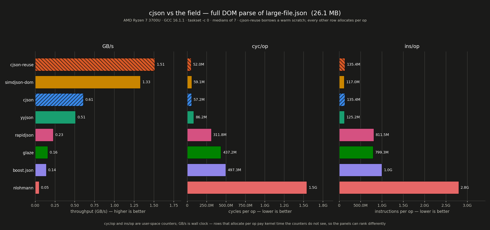
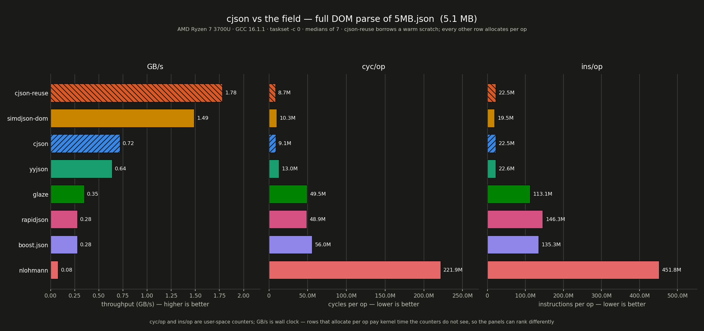
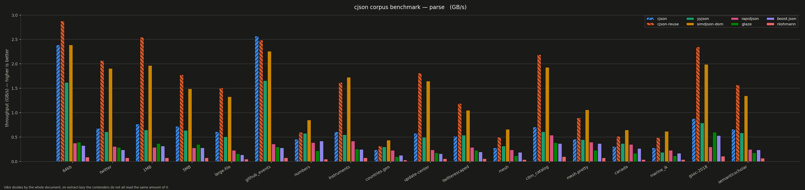

### *cjson* 🧙‍♂️

#### the fastest header-only C++26 JSON parsing library

<div align="left">

**cjson** is the fastest header-only C++26 JSON library: providing SIMD structural **parsing,
validation, minification, serialization, and writing**, a **lazy functional layer**, and a native
**compile-time (constexpr) mode**. Every function is `constexpr` qualified.

</div>

<br clear="left"/>

[](#)

[](https://opensource.org/licenses/MIT)
[](https://en.cppreference.com/w/cpp/26)

------

> [!WARNING]
> cjson is **micron-only**; there is no support for the STL or glibc.

#### Features

  - **two-stage SIMD engine**: 64-byte blocks to structural indexes / quote/escape masks
    / UTF-8 validation in one sweep, then a scalar FSM building a contiguous 16-byte
    value arena. amd64 (SSSE3/AVX2+PCLMUL), aarch64 (NEON), armv7 (NEON), and a SWAR
    floor
  - **native comptime mode**: `cjson::ct::parse<S>()` runs during compiletime and produces a
    document into two flat rodata arrays; validate, minify and serialize are `consteval` too
  - **on-demand reads**
  - **a lazy functional layer**: `fmap`/`filter`/`fold`/`take`/`flat_map`,
    curried for OCaml-style `|` pipes
  - **one-shot helpers**: `cjson::get<i64>(text, "/a/b")`
  - header-only, freestanding-capable, depends only on the *micron* core library

------

##### Quickstart

```cpp
#include <cjson/cjson.hpp>

i64 port = cjson::get_or<i64>(body, "/listen/port", i64(8080));

// on-demand
cjson::scratch sc;
auto v = cjson::iterate(body, sc);
auto root = v.cast<cjson::view>().root();
i64 exp = root["exp"].i64_or(0);
auto sub = root["sub"].str_raw();

// owning document
auto r = cjson::parse(body);
if ( r.is_second() ) { /* cjson::error_name(r.cast<cjson::error>()) */ }
const cjson::doc &d = r.cast<cjson::doc>();

// a lazy pipeline over it
namespace cj = cjson;
i64 total = d.root()["users"].items()
          | cj::filter_c(cj::field_bool("active"))
          | cj::pluck_c("age") | cj::fmap_c(cj::to_i64)
          | cj::fold_c(i64(0), cj::plus);

// build a response
cjson::builder b;
b.obj().kv("id", id).kv("name", name).end();
send(b.out().ptr, b.out().len);

// bake a config at build time
static constexpr cjson::ct::str k_cfg{ R"({"port":8080})" };
constexpr auto k_tree = cjson::ct::parse<k_cfg>();
static_assert(k_tree.root()["port"].i64_or(0) == 8080);
```

##### constexpr ready

Every function on the parse/validate/minify/write path is `constexpr`. Machine-specific
fast paths (SIMD kernels, `__builtin_memcpy` puns, abcmalloc arenas) sit behind
`if !consteval` with portable twins producing **identical results**. Comptime scratch is transient `new[]`. 

##### Benchmarks

<picture>
  <source media="(prefers-color-scheme: dark)" srcset="benches/charts/headline-large-filef.png">
  
</picture>

<picture>
  <source media="(prefers-color-scheme: dark)" srcset="benches/charts/headline-5MBf.png">
  
</picture>


<picture>
  <source media="(prefers-color-scheme: dark)" srcset="benches/charts/op-parse.gbpsf.png">
  
</picture>

<picture>
  <source media="(prefers-color-scheme: dark)" srcset="benches/charts/op-extract-dom.gbpsf.png">
  
</picture>
<picture>
  <source media="(prefers-color-scheme: dark)" srcset="benches/charts/op-serialize.gbps.dark.png">
  
</picture>

Full DOM parse throughput, **GB/s, higher is better**. AMD Ryzen 7 3700U, kernel 7.1.5,
GCC 16.1.1, `taskset -c 0`, medians of 7. Every contender parses the same bytes in copy
mode. `cjson-reuse` borrows a warm scratch; plain `cjson` allocates and frees per op.

Reproduce with `scripts/fetch_corpus && scripts/vsbuild benches/corpus_vs.cpp &&
taskset -c 0 ./bin/corpus_vs`, and graph it with `scripts/chart_corpus`.

| corpus | shape | size | cjson | cjson-reuse | yyjson | simdjson-dom | rapidjson | glaze | boost.json | nlohmann |
|---|---|---:|---:|---:|---:|---:|---:|---:|---:|---:|
| `64kb` | generic object soup | 56 KB | **2.41** | 2.38 | 1.48 | 1.95 | 0.35 | 0.37 | 0.31 | 0.08 |
| `github_events` | small API payload | 64 KB | 2.33 | **2.47** | 1.64 | 2.31 | 0.36 | 0.32 | 0.28 | 0.08 |
| `numbers` | pure float array | 147 KB | 0.36 | 0.60 | 0.41 | **0.77** | 0.24 | 0.16 | 0.24 | 0.05 |
| `instruments` | mixed scalars | 215 KB | 0.52 | 1.43 | 0.53 | **1.70** | 0.36 | 0.24 | 0.23 | 0.07 |
| `countries.geo` | GeoJSON, deep coord arrays | 251 KB | 0.21 | 0.34 | 0.27 | **0.53** | 0.25 | 0.11 | 0.14 | 0.03 |
| `update-center` | string heavy | 521 KB | 0.53 | **1.71** | 0.46 | 1.48 | 0.22 | 0.17 | 0.16 | 0.05 |
| `twitterescaped` | `\uXXXX` escape heavy | 549 KB | 0.47 | **1.13** | 0.52 | 0.99 | 0.25 | 0.22 | 0.18 | 0.06 |
| `twitter` | social API, unicode | 617 KB | 0.64 | **1.95** | 0.56 | 1.87 | 0.30 | 0.26 | 0.22 | 0.07 |
| `mesh` | flat float arrays | 707 KB | 0.25 | 0.45 | 0.29 | **0.62** | 0.20 | 0.10 | 0.16 | 0.04 |
| `citm_catalog` | object/map heavy | 1.6 MB | 0.62 | **1.83** | 0.57 | 1.66 | 0.48 | 0.34 | 0.33 | 0.09 |
| `canada` | float arrays, geo coords | 2.1 MB | 0.29 | 0.48 | 0.34 | **0.64** | 0.33 | 0.16 | 0.24 | 0.04 |
| `5MB` | generated object soup | 4.9 MB | 0.66 | **1.80** | 0.60 | 1.67 | 0.27 | 0.30 | 0.29 | 0.07 |
| `1GB` | generated, number-heavy | 1.07 GB | 0.24 | 0.46 | 0.27 | **0.55** | — | — | — | — |

> Note the two right-hand panels against the first: `cyc/op` and `ins/op` are
> **user-space** counters, `GB/s` is wall clock. A row that allocates per op suffers
> page-faults and `mmap` time in the kernel, not tracking by the counters.

------

##### API

All entry points live in `namespace cjson`. Types are *micron* types.

```cpp
namespace cjson {

// types
using bytes  = micron::raw_slice<const u8>;    // borrowed input view
using wbytes = micron::raw_slice<u8>;          // buffer
using strv   = micron::raw_slice<const char>;  // strings out of getters ({.ptr,.len})
using fjson  = micron::slice<u8>;              // owned byte output

enum class kind : u8 { none, raw, null, boolean, number, string, array, object };

enum class error : i32 {
  ok, bad_syntax, bad_number, bad_string, bad_escape, bad_utf8, bad_surrogate,
  depth_exceeded, trailing_garbage, empty_input, short_output, wrong_type,
  no_such_field, out_of_range, oom,
};
constexpr const char *error_name(error) noexcept;

// result<T> is micron::option<T, error>.
// success is is_first(), failure is is_second(), payload via cast<T>()
template <typename T> using result = micron::option<T, error>;

struct opts {
  bool numbers_as_raw   : 1 = false;  // store numbers as raw {ofs,len}, no conversion
  bool skip_utf8        : 1 = false;  // skip utf-8 validation of the input
  bool stop_when_done   : 1 = false;  // accept trailing bytes after the first root
  bool relaxed          : 1 = false;  // comments + trailing commas (not implemented yet)
  bool with_write_bound : 1 = false;  // accumulate O(1) writer bounds during stage 2
};

struct style {
  u8   indent     = 0;      // 0 = minified; 2/4 pretty
  bool ascii_only = false;  // not implemented yet
};

template <typename C> concept byte_source  = /* iterable container of trivially-copyable */;
template <typename C> concept text_source  = byte_source<C> || micron::is_string<C>;

bytes  as_bytes(const C &);        wbytes as_wbytes(C &);
constexpr strv as_strv(const char *);   // + strv and has_cstr overloads

// scratch and doc
struct scratch {                         // move-only
  constexpr bool ensure(usize) noexcept; // idx
  constexpr bool ensure_pool(usize) noexcept;
  constexpr bool ensure_vals(usize) noexcept;
  constexpr void release() noexcept;     // the three buffers release independently
};

class doc {                              // move-only
  constexpr val   root() const noexcept;
  constexpr usize size() const noexcept;      // value-arena slots
  constexpr usize consumed() const noexcept;  // byte offset one past the root
  constexpr bool  borrowed() const noexcept;
  constexpr bool  alive() const noexcept;
  constexpr void  release() noexcept;
};

// parse / validate
// every fn below also takes: (const char*, usize), (const u8*, usize), strv, bytes, any byte container, and any micron::is_string
result<doc> parse(bytes, opts = {});                    // owning
result<doc> parse(bytes, opts, scratch &);              // owning, warm scratch
result<doc> parse_reuse(bytes, opts, scratch &);        // borrows the scratch
result<doc> parse_insitu(wbytes, opts = {});            // rewrites the input
result<doc> parse_insitu(C &, opts = {});               // mutable container/string
result<doc> parse_insitu_reuse(wbytes, opts, scratch &);

constexpr error validate(bytes, opts = {}) noexcept;
constexpr error validate(bytes, opts, scratch &) noexcept;
constexpr bool  is_valid(bytes, opts = {}) noexcept;


// general usage fns
constexpr kind  type()   const noexcept;
constexpr usize size()   const noexcept;  // val: elements / PAIRS / bytes by kind
constexpr usize count()  const noexcept;  // cur: same, by walking
constexpr explicit operator bool() const noexcept;
constexpr bool  is_null() const noexcept;

// lossy
constexpr i64  i64_or (i64  = 0)     const noexcept;
constexpr u64  u64_or (u64  = 0)     const noexcept;
constexpr f64  f64_or (f64  = 0)     const noexcept;
constexpr bool bool_or(bool = false) const noexcept;
constexpr strv str_or (strv = {})    const noexcept;   // val: escapes decoded
constexpr strv str_raw()             const noexcept;   // cur: escapes retained
constexpr max_t str(wbytes out)      const noexcept;   // cur: decode into your buffer

constexpr result<i64>  try_i64()  const noexcept;
constexpr result<u64>  try_u64()  const noexcept;
constexpr result<f64>  try_f64()  const noexcept;
constexpr result<bool> try_bool() const noexcept;
constexpr result<strv> try_str()  const noexcept;

// navigation
constexpr val/cur operator[](strv key) const noexcept;  // first match wins on dupes
constexpr val/cur at(usize i)          const noexcept;  // unambiguous array index
constexpr val/cur at_pointer(strv ptr) const noexcept;  // rfc 6901; "" names the root

// iteration
constexpr arr_range     items()   const noexcept;  // yields val
constexpr obj_range     members() const noexcept;  // yields member { strv key; val v; }
constexpr cur_arr_range items()   const noexcept;  // yields cur
constexpr cur_obj_range members() const noexcept;  // yields cur_member { strv key; cur v; }

// on-demand
result<view> iterate(bytes, scratch &);         // opts defaulted
result<view> iterate(bytes, opts, scratch &);
class view { constexpr cur root() const noexcept; constexpr bool alive() const noexcept; };

// functional adaptors/lazy pipelines

// adaptors            eager, function-first        curried, range-last
fmap(fn, r)            filter(p, r)                 fmap_c(fn)      filter_c(p)
reject(p, r)           take(n, r)   drop(n, r)      reject_c(p)     take_c(n)  drop_c(n)
take_while(p, r)       drop_while(p, r)             take_while_c(p) drop_while_c(p)
enumerate(r)           flat_map(fn, r)              enumerate_c()   flat_map_c(fn)
keys(r)  values(r)     pluck(key, r)                keys_c() values_c() pluck_c(key)

// terminals
fold(r, init, fn)      count(r)        count_if(p, r)
any_of(p, r)           all_of(p, r)    none_of(p, r)
find_first(p, r)       -> result<T>   
max_by(proj, r)        min_by(proj, r) -> result<T>
for_each(fn, r)
// ... each with a _c (curried) form: fold_c(init, fn), any_of_c(p), find_first_c(p)

// terminal
collect_into<C>(r)     collect_into_c<C>()

// combinators and projections
plus  minus  times  max_of  min_of
to_i64  to_u64  to_f64  to_bool  to_str
is_truthy   is_kind(k)   has(key)   key_is(key)
field(key)          
field_i64(key)  field_u64(key)  field_f64(key)  field_bool(key)   // ordered/typed


// one shot helpers
template <class T> result<T> get(jtext, jptr, opts = {});        // i64/u64/f64/bool/string
template <class T> result<T> get(jtext, jptr, scratch &);
template <class T> T         get_or(jtext, jptr, T dflt, opts = {});
result<strv>  get_str_raw(jtext, jptr, scratch &);   // borrows

bool          exists(jtext, jptr, opts = {});
kind          kind_at(jtext, jptr, opts = {});
result<usize> count_at(jtext, jptr, opts = {});
error         each(jtext, jptr, Fn);                 // Fn takes cur or cur_member

bool                   valid(jtext, opts = {}) noexcept;
result<micron::string> compact(jtext, opts = {});
result<micron::string> pretty(jtext, u8 indent = 2, opts = {});
result<micron::string> reformat(jtext, style, opts = {});

// writing
constexpr usize write_bound(const doc &, style = {}) noexcept;  // O(1) with .with_write_bound
constexpr max_t write_into(const doc &, wbytes, style = {}) noexcept;
fjson           write(const doc &, style = {});                 // owning
micron::string  write_str(const doc &, style = {});

constexpr usize minify_bound(usize n) noexcept;                 // == n
constexpr max_t minify(bytes in, wbytes out, opts = {}) noexcept;
result<fjson>          minify(bytes, opts = {});
result<micron::string> minify_str(bytes, opts = {});

class builder {
  builder();  explicit builder(micron::string &&reuse);  // recycle the buffer
  error err() const noexcept;
  builder &obj();  builder &arr();  builder &end();
  builder &key(strv);                              // + const char*, is_string
  builder &value(strv);                            // + const char*, is_string
  builder &value(i64/u64/i32/u32/f64/bool);
  builder &null();
  builder &raw(strv json);                         // preserialized, trusted verbatim
  template <class V> builder &kv(key, V v);
  strv           out() noexcept;                   // empty unless balanced and clean
  micron::string take() noexcept;                  // move the buffer out, reset
};

} // namespace cjson

namespace cjson::ct {   // comptime consteval

template <usize N> struct str;             // NTTP carrier for a json literal
template <str S, opts O = {}> consteval bool  validate();
template <str S, opts O = {}> consteval auto  minify();        // -> bytes<N>
template <str S, opts O = {}> consteval auto  parse();         // -> tree<NV, NS>
template <auto &Tree, style St = {}> consteval auto write();   // -> bytes<N>
```

`examples/` has eight programs covering each layer:

| | |
|---|---|
| `01_quickstart.cpp` | parse → read → build → write, end to end |
| `02_dom.cpp` | `doc`/`val`, getters, iteration, pointers, lifetimes |
| `03_ondemand.cpp` | `iterate`, scratch reuse, and the borrowing rules |
| `04_functional.cpp` | the whole `fp` layer, laziness made visible |
| `05_oneshot.cpp` | `get`/`exists`/`each`/`pretty` and friends |
| `06_build_write.cpp` | `builder`, `write`, `minify`, the sticky error |
| `07_comptime.cpp` | `ct::` — almost entirely `static_assert` |
| `08_strings.cpp` | every text flavour through every entry point |

##### Configuration

```cpp
CJSON_DEPTH_LIMIT     // nesting cap; default 1024, 0 folds the counter away entirely
```

##### Building & integration

Header-only. *micron* core headers must be reachable as `<micron/...>`; requires C++26 (GCC 16+).

```
duck batch build.duck        # tools et al
duck batch tests.duck        # snowball suites (exit 1 == pass per binary)
duck batch examples.duck     # eight examples
scripts/ctbuild              # comptime stress tier (raised constexpr limits)

duck batch benches.duck                  # benches
scripts/fetch_corpus                     # wide-net corpus into sample/web/
scripts/vsbuild benches/corpus_vs.cpp    # head-to-head against six libraries
taskset -c 0 ./bin/corpus_vs > benches/results/corpus_vs.txt
scripts/chart_corpus benches/results/corpus_vs.txt --headline
scripts/chart_corpus benches/results/corpus_vs.txt --all-metrics
scripts/chart_corpus benches/results/corpus_vs.txt --headline --mode dark
scripts/snapshot <bench>
```

A full `corpus_vs` sweep is long, nlohmann and boost.json are two orders of magnitude
slower than cjson on the object-heavy corpora. Pass `only=` to reduce fields benchmarked.

```
taskset -c 0 ./bin/corpus_vs parse only=twitter,canada,numbers
```

##### Limitations

  - **No runtime CPU dispatch** by design: a binary built with AVX2 requires AVX2.
  - The lazy `fp` layer is **left-fold only**
  - A warm scratch holds memory proportional to the largest document it has seen until
    `release()`.
  - Depends on the *micron* core library as its sole dependency.

------

#### License

MIT License — see LICENSE.
